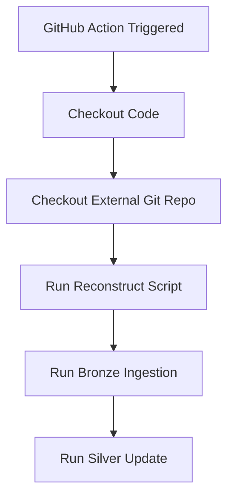

# Skypilot-Iceberg

## Overview

The Skypilot-Iceberg project automates:
- Git history extraction from any repository
- Storing changes as Bronze and Silver Iceberg tables
- Managing checkpoints to avoid reprocessing
- Supporting local and cloud (R2) environments

---


## 🛠 Installation

```bash
pip install -r requirements.txt
```

### Create a .env file with:

```
SUPABASE_URL=your_supabase_url
SUPABASE_KEY=your_supabase_key
R2_WAREHOUSE=s3://your-r2-bucket
R2_CATALOG_URI=https://your-r2-catalog
R2_TOKEN=your_r2_token
STORAGE_TARGET=local
```

### 🚀 How It Works

```mermaid
flowchart TD
    A[Git Repository] -->|git ls-files, git log| B[Extract Files per Commit]
    B -->|store CSV| C[Git File History CSV]
    C -->|append| D[Bronze Iceberg Table]
    D -->|deduplicate| E[Silver Iceberg Table]
    E -->|used for| F[Analytics / Pricing]

    B --> G[Checkpoint in Supabase]
    G -->|last commit tracked| B
````

### usage

```
make reconstruct   # Extract Git files
make bronze        # Ingest into Bronze Iceberg
make silver        # Update Silver Iceberg
```
### Or individually:

```
python scripts/1_reconstruct_git_files.py --repo path/to/repo --output git_file_history.csv --resume
python scripts/2_convert_to_iceberg.py --csv git_file_history.csv --storage local
python scripts/3_update_silver.py --storage local
```

##  GitHub Actions Pipeline




## 📋 Iceberg Table Details
Bronze Table: skypilot.bronze.vms
-  Append-only, full history
    - Partitioned by cloud
- Silver Table: skypilot.silver.vms
	- Latest prices
	- Deduplicated by (cloud, instanceType, Region, AvailabilityZone)


### ✨ Future Improvements
- Add compaction for Bronze table
- Add Gold tables for pricing analytics
- Integrate DuckDB or Trino for querying
- Add Slack/GitHub notifications on failures
